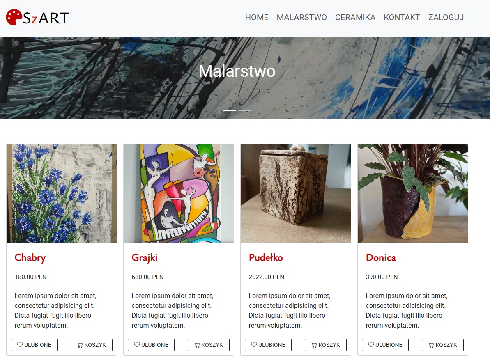

# Szart

Szart is a unique Web Store App showing my paintings and ceramics.
This my own first Django application created to practice and learn new framework. 



#### Features
Browse and Explore: Users can navigate through the available products in the store, featuring a diverse collection of paintings and ceramics.

Interactive Experience: Once logged in, users can engage with the platform by liking their favorite products, adding them to their cart, and placing orders seamlessly.

Contact Form: A convenient contact form is provided for users to reach out with any inquiries or feedback they may have.


## Running Locally

To run this application locally, follow these steps:

#### Prerequisites

- Python 3.x installed on your machine
- Pip package manager installed
- Virtualenv installed

#### Setting up Virtual Environment

1. Clone this repository to your local machine:

   ```bash
   git clone git@github.com:MariaSzarek/109_Szart.git
   ```

2. Navigate to the project directory:

   ```bash
   cd 109_Szart\szart
   ```

3. Create a virtual environment:

   ```bash
   virtualenv venv
   ```

4. Activate the virtual environment (on Windows):

   ```bash
   venv\Scripts\activate
   ```

5. Install dependencies:

   ```bash
   pip install -r requirements.txt
   ```

#### Running the Application

1. Make migrations:

   ```bash
   python manage.py makemigrations
   ```

2. Apply migrations:

   ```bash
   python manage.py migrate
   ```

3. Run the server:

   ```bash
   python manage.py runserver
   ```

4. Access the application in your browser at [http://127.0.0.1:8000/](http://127.0.0.1:8000/)

## Running Tests

To run tests for this application, ensure you have activated the virtual environment. Then, run the following command:

```bash
python manage.py test
```

## To-Do List
- Add full order procedure
- Add more tests